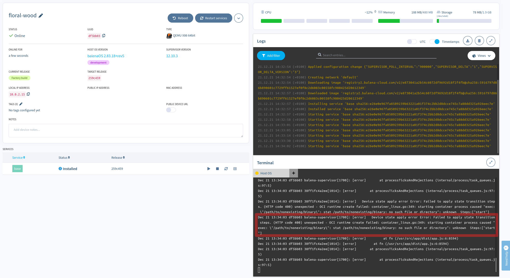

# Missing error in log

The added service is trying to execute a binary that does not exist.
This produces an error in `journalctl` that is clear to understand, but no error in the dashboard.
Having some error in the dashboard (log section, most likely) would help debug these kind of issues.

See image below.

