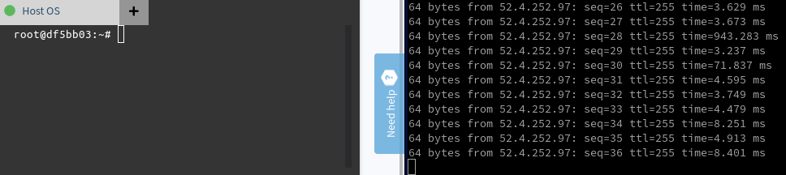

# Network connectivity

The connection to devices seems relatively slow.
This is most noticeable when typing in the terminal using balena dashboard.
On my laptop I have installed a device in a virtual machine.
`ip address` shows:

```
12: resin-vpn: <POINTOPOINT,MULTICAST,NOARP,UP,LOWER_UP> mtu 1500 qdisc fq_codel qlen 100
    link/[65534] 
    inet 10.240.61.161 peer 52.4.252.97/32 scope global resin-vpn
       valid_lft forever preferred_lft forever
    inet6 fe80::fc95:df81:6001:90a7/64 scope link 
       valid_lft forever preferred_lft forever
```

Pinging this VPN address (which appears to be an AWS Virginia instance):

```
root@df5bb03:~# ping 52.4.252.97
PING 52.4.252.97 (52.4.252.97): 56 data bytes
64 bytes from 52.4.252.97: seq=0 ttl=255 time=87.217 ms
64 bytes from 52.4.252.97: seq=1 ttl=255 time=136.881 ms
64 bytes from 52.4.252.97: seq=2 ttl=255 time=89.789 ms
64 bytes from 52.4.252.97: seq=3 ttl=255 time=87.734 ms
64 bytes from 52.4.252.97: seq=4 ttl=255 time=89.554 ms
64 bytes from 52.4.252.97: seq=5 ttl=255 time=1380.603 ms
64 bytes from 52.4.252.97: seq=6 ttl=255 time=381.241 ms
64 bytes from 52.4.252.97: seq=7 ttl=255 time=143.814 ms
64 bytes from 52.4.252.97: seq=8 ttl=255 time=90.871 ms
64 bytes from 52.4.252.97: seq=9 ttl=255 time=87.678 ms
64 bytes from 52.4.252.97: seq=10 ttl=255 time=89.695 ms
64 bytes from 52.4.252.97: seq=11 ttl=255 time=89.646 ms
64 bytes from 52.4.252.97: seq=12 ttl=255 time=89.897 ms
64 bytes from 52.4.252.97: seq=13 ttl=255 time=90.069 ms
64 bytes from 52.4.252.97: seq=14 ttl=255 time=87.719 ms
64 bytes from 52.4.252.97: seq=15 ttl=255 time=87.830 ms
64 bytes from 52.4.252.97: seq=16 ttl=255 time=88.431 ms
64 bytes from 52.4.252.97: seq=17 ttl=255 time=127.061 ms
64 bytes from 52.4.252.97: seq=18 ttl=255 time=89.944 ms
64 bytes from 52.4.252.97: seq=19 ttl=255 time=588.071 ms
64 bytes from 52.4.252.97: seq=20 ttl=255 time=1430.018 ms
64 bytes from 52.4.252.97: seq=21 ttl=255 time=430.624 ms
64 bytes from 52.4.252.97: seq=22 ttl=255 time=350.630 ms
64 bytes from 52.4.252.97: seq=23 ttl=255 time=89.349 ms
64 bytes from 52.4.252.97: seq=24 ttl=255 time=90.262 ms
64 bytes from 52.4.252.97: seq=25 ttl=255 time=89.417 ms
64 bytes from 52.4.252.97: seq=26 ttl=255 time=91.862 ms
64 bytes from 52.4.252.97: seq=27 ttl=255 time=162.033 ms
64 bytes from 52.4.252.97: seq=28 ttl=255 time=88.236 ms
64 bytes from 52.4.252.97: seq=29 ttl=255 time=209.840 ms
64 bytes from 52.4.252.97: seq=30 ttl=255 time=90.318 ms
64 bytes from 52.4.252.97: seq=31 ttl=255 time=87.614 ms
64 bytes from 52.4.252.97: seq=32 ttl=255 time=121.998 ms
```

Around 90msec for a connection to Virginia seems to be expected, but there are some significant outliers.
I have no clue why this connection seems so unstable.

Are there VPN instances closer to Europe?
Can these be configured somehow?

## Running a device closer to the VPN

I also tried running a device in AWS EC2 Virginia.
Ping times are better, but still there are issues:

```
64 bytes from 52.4.252.97: seq=100 ttl=255 time=3.801 ms
64 bytes from 52.4.252.97: seq=101 ttl=255 time=5.234 ms
64 bytes from 52.4.252.97: seq=102 ttl=255 time=3.805 ms
64 bytes from 52.4.252.97: seq=103 ttl=255 time=887.170 ms
64 bytes from 52.4.252.97: seq=104 ttl=255 time=3.571 ms
64 bytes from 52.4.252.97: seq=105 ttl=255 time=4.942 ms
64 bytes from 52.4.252.97: seq=106 ttl=255 time=8.346 ms
64 bytes from 52.4.252.97: seq=107 ttl=255 time=3.702 ms
64 bytes from 52.4.252.97: seq=108 ttl=255 time=4.130 ms
64 bytes from 52.4.252.97: seq=109 ttl=255 time=7.627 ms
64 bytes from 52.4.252.97: seq=110 ttl=255 time=57.820 ms
64 bytes from 52.4.252.97: seq=111 ttl=255 time=9.081 ms
64 bytes from 52.4.252.97: seq=112 ttl=255 time=8.476 ms
64 bytes from 52.4.252.97: seq=113 ttl=255 time=4.005 ms
```

These coincide with lag in the dashboard.
The capture below is recorded while pressing `'a'` and recording the ping response times at the same time.



Sidenote: typing in the instance in Virginia feels in general more responsive (with the exception of the lag spikes mentioned above).
This makes sense, because I imagine pressing a key causes the following sequence:

1. 'a' is sent from my browser to the VPN.
2. 'a' is sent from the VPN to the device.
3. The terminal update is sent from the device to the VPN.
4. The terminal update is sent from the VPN to my browser.

With my local balena device, a roundtrip takes ~90msec, meaning it takes at least ~180msec before I see the character on my screen.
With the device on AWS EC2 Virginia the delay between me and the VPN / device is still 45msec (items 1 and 4 above), but the delay between the device and the VPN is just a few milliseconds.
That means that it now takes at least ~95msec (assuming ~5msec between VPN and device).
Add to that the lag spikes and I think it can explain a large part of our network performance.
