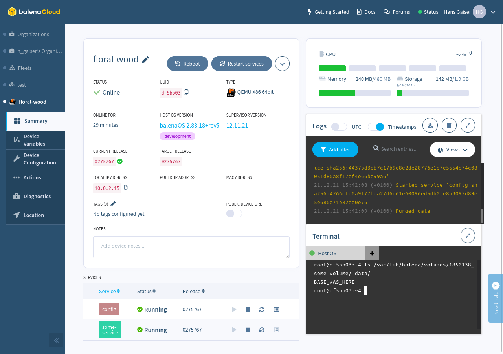
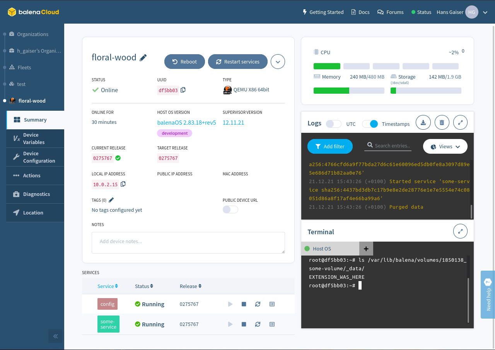

# Purge not working as expected

This issue shows a misconfiguration.
The goal is for only one service to populate a volume with configuration data (`config` in this example).
By accident, however, another service was also placing something in that volume (`some-service` in this example).
I would not expect this to be an issue since that service depends on the configuration service.
After deploying it always seems to work correctly.
However after purging data, it seems to be a race condition which service ends up "claiming" the volume.

This is the volume after deploying:

This is the volume after purging:

Note that after purging it can happen that `BASE_WAS_HERE` or `EXTENSION_WAS_HERE` is present in the volume, depending on the race condition.
I have also noticed one time that both files were present in the volume, no clue how that happened.
